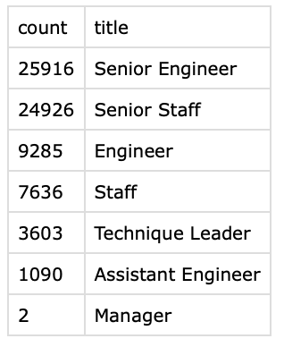
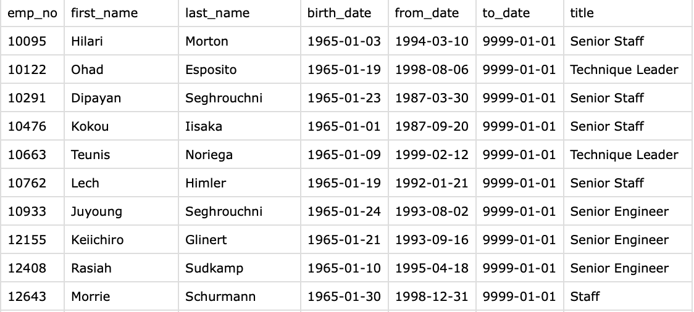
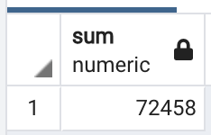
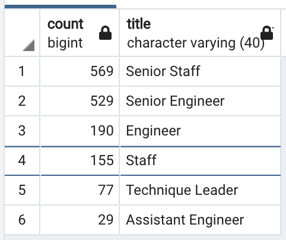

# **RETIRING EMPLOYEES PER TITLE AND MENTORSHIP PROGRAM**

## ***OVERVIEW***

### The purpose of this analysis is to provide valuable information to Pewlett Hackard in order to be prepared for the upcoming "Silver Tsunami" of its current employees.

## ***RESULTS***

### **Retiring employees by title**

#### From the image above we can see the following:
#### 1. The number of employees leaving the company is really high, as high as 72,458. This requires the company to really prepare in such a way that can somehow copensate the massive employee leaving.
#### 2. From the previous total, 70% are senior employees, which means the company is going to loose a big amount of expertise, so actions need to be taken to try to transfer those skills.

#### The table below is a fragment of the mentorship eligibility analysis performed, from which we can highlight the following:
#### 3. There are 1,549 current employees that are eligible for the mentorship program, which might not be enough to transfer the knowledge, giving the high quantity of people that is going to leave the company.
#### 4. Fortunately, most of them are senior employees, which will allow to better abosrb the transferred knowledge, giving their experience in the company.

## ***SUMMARY***

### There is a total of 72,458 positions distributed in 7 different roles: Senior Engineer, Senior Staff, Engineer, Staff, Technique Leader, Assistant Engineer and Manager.

### As we can see in the image below, there are not enough employees in the mentorship program to mentor the next generation Pewlett Hackard employees, so the company needs to evaluate on some other alternatives, such as hiring some leaving employees as consultant to fill some gaps. For example, there are only 529 Senior Engineers compared to the 25,916 that are leaving the company.

